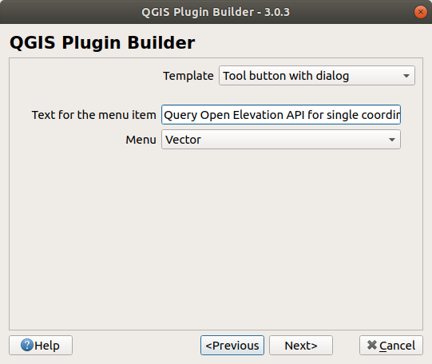
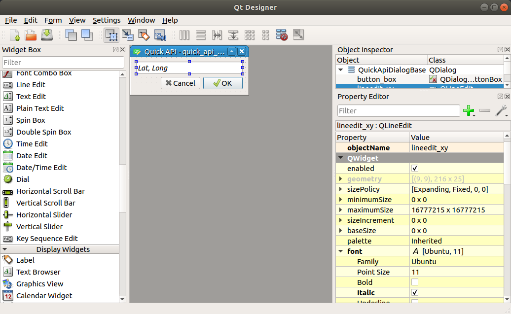

# Create a quick QGIS 3 Plugin

This tutorial is not intended to be a deep dive into QGIS plugin development, but rather a guideline for creating a plugin from available boiler plate code based on the very useful [Plugin Builder](http://g-sherman.github.io/Qgis-Plugin-Builder/). It focuses a lot on the conceptual how's and why's of Python plugins. The actual development part is quite quick.

**Goals**:

- get more familiar with `PyQGIS` and `PyQt5` and the respective documentation
- build a GUI with QGIS native Qt Designer
- connect GUI elements to Python functions
- deploy the plugin locally and upload to QGIS official plugin repository

**Plugin functionality**:

- User copy/pastes X, Y coordinates into a text field
- Upon OK button click, the [Open Elevation API] is queried
- A z-enabled Point layer is generated in-memory

The usefulness of the plugin is highly debatable but you will understand important concepts by the end.

> **Disclaimer**
>
> Validity only confirmed for **Ubuntu 18.04** and **QGIS v3.4**
> Occassionally, the author might choose to give hints on Windows-specific setups. `Ctrl+F` for WINDOWS flags. Mac OS users should find the instructions reasonably familiar.

## Table of Contents

<!-- TOC depthFrom:2 depthTo:4 withLinks:1 updateOnSave:1 orderedList:0 -->

- [Prerequisites](#prerequisites)
	- [Hard prerequisites](#hard-prerequisites)
	- [Recommendations](#recommendations)
- [First steps](#first-steps)
	- [Plugin Builder](#plugin-builder)
		- [About Plugin Builder](#about-plugin-builder)
		- [Run Plugin Plugin Builder](#run-plugin-plugin-builder)
		- [Generated files](#generated-files)
	- [Test initial plugin](#test-initial-plugin)
		- [Compile `resources.qrc`](#compile-resourcesqrc)
		- [Copy code to plugin directory](#copy-code-to-plugin-directory)
		- [Load plugin](#load-plugin)
		- [Troubleshooting](#troubleshooting)
- [Build GUI](#build-gui)
	- [](#)

<!-- /TOC -->

## Prerequisites

### Hard prerequisites

- Basic understanding of Python
- QGIS v3.x
- [Plugin Builder](https://plugins.qgis.org/plugins/pluginbuilder3/) QGIS plugin installed
- Python >= 3.6 (should be your system Python3)

### Recommendations

- Use an IDE, such as [Sypder](https://www.spyder-ide.org) or [PyCharm](https://www.jetbrains.com/pycharm/)
- Even though we're developing **on** Ubuntu, we should make sure Windows users can use the plugin as well. **Doesn't seem like there is a list for OSGeo4W python packages, awaiting answer from dev list**
- Use the system's Python3 as interpreter for your IDE: `/usr/bin/python3`
- **WINDOWS**: you're locked in with OSGeo4W for QGIS, but you can have a look [here](https://trac.osgeo.org/osgeo4w/wiki/ExternalPythonPackages#UsestandardWindowsinstallers) on how to change your default Python interpreter to the one shipped with OSGeo4W, for a better developing experience

If you follow above recommendations, you should now be able to run the following in your IDE's Python console:

```bash
import qgis
import PyQt5
```

If that was successful, you're all set to start the development!

### Troubleshooting

- if you can't import qgis and/or PyQt5, you likely are not working with the correct Python executable, i.e. the system's Python3. Typing `import sys; print(sys.executable)` should print `/usr/bin/python3.6`

- if that's the case, your QGIS installation is probably broken. A re-installation will help.

## First steps

### Plugin Builder

#### About Plugin Builder

The Plugin Builder arguably takes a lot of work off your shoulders, as it creates all necessary boiler plate code you need to immediately start development. However, we found the amount of (well-intended) overhead it imposes on developers a little overwhelming in the beginning. Consequently, we'll focus for the rest of the tutorial on the most crucial parts of your new plugin and ignore the rest.

#### Run Plugin Builder

If you have successfully installed the Plugin Builder 3 plugin, it is available in the 'Plugins' menu in QGIS. Make sure to fill out the details similar to ours:


Note, there will be a few more dialogs, just use common sense when filling those in. Or accept the defaults.

After confirming where to store your new plugin, you'll presented with a dialog detailing what to find where and which steps to take from this point on. For the sake of this tutorial (and maybe your sanity), ignore its contents. If anything goes wrong with the short descriptions it provides you'll be left with more questions than answers.

#### Generated files

The Plugin Builder will have generated a lot of files now. Head over to your new plugin project directory and `ll .`. To avoid confusion and make it as simple as possible, you can safely delete all files and folders except for these:

```bash
├──quickapi
   ├──i18n
   |  └──af.ts
   ├──icon.png
   ├──__init__.py 									# mandatory for minimal plugin
   ├──metadata.txt
   ├──quick_api.py									# mandatory for minimal plugin
   ├──quick_api_dialog.py						# mandatory for minimal plugin
   ├──quick_api_dialog_base.ui			# mandatory for minimal plugin
   ├──resources.py
   └──resources.qrc									# mandatory for minimal plugin
```

This is still a lot to take in. So let's look at them in little more detail:

- `i18n`: this folder contains translation files. Just note, that you will have the folder present for now so the plugin doesn't crash. A detailed explanation is beyond the scope of this tutorial.

- `icon.png`: the default icon for the plugin. You will change this to reflect your own icon.

- `__init__.py`: contains the function which will initialize the plugin on QGIS startup and register it with QGIS, so it knows about this plugin.

- `metadata.txt`: contains information about the plugin, which will be used by the official QGIS plugin repository and the QGIS Plugin Manager to display information about your plugin, e.g. description, version, author, URL etc.

- `quick_api.py`: contains the heart of the plugin: all custom functionality will go into this file.

- `quick_api_dialog.py`: loads the plugin User Interface (UI), when QGIS starts up. You won't alter this file in this tutorial.

- `quick_api_dialog_base.ui`: this is the Qt Designer file to style and build the UI, i.e. plugin window.

- `resource.qrc`: contains the resources for Qt. It's usually only needed to tell QGIS where to find the plugin icon. You will only edit this file when you rename plugin icon or you want to add additional icons. **Needs to be compiled to resources.py**.

### Test initial plugin

At this point you can already test if QGIS loads your new (very unfunctional) plugin.

#### Compile `resources.qrc`

First you need to compile the `resources.qrc` file to `resources.py`, so that the plugin can pick up the Qt settings:

```bash
pyrcc5 -o resources.py resources.qrc
```

#### Copy code to plugin directory

Next, you should create the directory where your plugin will be picked up by QGIS on startup and copy all files there:

```bash
cp -arf ../quickapi $HOME/.local/share/QGIS/QGIS3/profiles/default/python/plugins/
```

Run this command whenever you change something in your development project.

#### Load plugin

Start QGIS and head over to `Plugins > Manage and Install Plugins` et voila:


If you activate it, note how a toolbar icon is created. Also, you'll find the plugin in the 'Vector' menu in QGIS. No worries, you'll change all that:)

#### Troubleshooting

- if you don't see the plugin in the manager after a QGIS restart, check you didn't accidentally set the `experimental` flag by allowing experimental plugins in `Plugin Manager > Settings`.

- if you experience a Python error, you likely did something wrong in the previous steps. Best bet: start from scratch before you dump an inconceivable amount of time in finding the bug.

## Qt Designer

First, start Qt Designer. The app is shipped on all OS's with QGIS and should be available as an executable on your computer.

### Short roundup of Qt Designer

In the startup dialog, open `quickapi/quick_api_dialog_base.ui` and you'll see your bare-bone plugin UI. For easier navigation, here's a quick breakdown of the Qt Designer interface:



#### 1 Available widgets

In Qt lingo all GUI elements are classified as `Widgets`, which can have all kinds of actual UI functionality like buttons, containers or user input elements. Drag a few widgets into your dialog and experiment a bit. There's also a few custom QGIS widgets at the very bottom, which provide additional functionality (like CRS picker)

#### 2 Object inspector

You can click on widgets in your dialog to select them. But sometimes it's good to see the hierarchy of widgets or select it from a list, e.g. when they're overlapping each other in the dialog.

#### 3 Property Editor

Each widget exposes a list of properties, like geometry or font, which you will find in this panel. You didn't see any actual code yet, but these properties are accessible methods through the Python class of your GUI. So it's also a good reference to available widget properties to be modified. It gives you a whole lot more information though:
- the name you give the widget
- the PyQt5 class name, e.g. `QDialogButtonBox` for the OK/Cancel button group
- you can immediately see the sub-classing for each widget by examining the tabs of the Property dialog. E.g. the `QDialogButtonBox` is sub-classed from (in descending order):
	- `QObject`, which only exposes the `objectName` property and will be widget identifier in your code
	- `QWidget`, which exposes multiple properties, mostly layout related
	- and finally `QDialogButtonBox`, which has mostly functional properties, e.g. which buttons are displayed

#### 4 Layout toolbar

Quick access to different layouts for container widgets. Explanation follows in [a following section](#important-qt-designer-concepts).

### Build GUI

You will build a very simple GUI: only a small box where the user can paste a X, Y coordinate pair.

Do the following steps:

1. Select the dialog window and press `Lay Out Vertically` button in the [toolbar](#layout-toolbar)
2. Drag a line edit widget above the buttons (`Input Widgets > Line Edit`)
3. Alter the following properties:
	- `QObject.objectName`: lineedit_xy
	- Check `QWidget.font.Italic`
	- `QLineEdit.text`: Lat, Long

Now, your GUI should look like this:



### Important Qt Designer concepts

- **Every container widget needs a layout!** In your case that's only the `QDialog` dialog window containing both the line edit widget and `QDialogButtonBox`. Layouts help you in... well, layouting (to keep consistent element spacing when resizing etc.). Try other layout types and add a few more widgets to see the differences.

- **Every widget needs a unique name property defined in `QObject.objectName`!** Well, that's not a hard requirement, but it's highly recommended. If you extend your plugin with more widgets, try to be structured with widget names. It'll help you a lot when you access them in your code later on.

## Code

In this tutorial we will throw a few fundamental programming principles over board and focus only on the most crucial parts of a QGIS plugin. To this end, we will **not**:

- separate GUI logic from processing logic
- write unit tests

These are really mantras you can't repeat often enough. So shame on us, really. But that's for another day.

You will work exclusively with `quick_api.py`. But we'll give a short explanation of `quick_api_dialog.py` as well, for reference.

### Library documentation: Help yourself!

Before we start to get into the fun part, just a quick reminder on how to best help yourself once you're stuck. If you're an experienced developer, you can probably skip this section. Still helpful to have the links below though.

#### PyQt5

PyQt5 is the GUI framework QGIS relies on. All UI related object, methods and properties can be found in this library. Mostly, you'll deal with `PyQt5.QWidgets` and `PyQt5.QtGui`.

Unfortunately, the direct code documentation of PyQt5 provided by Riverside is really bad (compared to the really good PyQt4). However, there are a few ways to help yourself here:

- you're using an IDE? Great! If you're lucky `Ctrl+Q` in PyCharm (`Ctrl+I` in Spyder) will show input and output parameters of the selected function.

- the main documentation is [here](http://pyqt.sourceforge.net/Docs/PyQt5/QtWidgets.html#PyQt5-QtWidgets). However, it usually only refers you to the C++ documentation of the Qt library, which PyQt5 wraps for Python. That documentation can be slightly overwhelming. You'll get through it though, just consider these few guidelines (taking `QLineEdit` as reference):
	- in [Functions](https://doc.qt.io/qt-5/qlineedit.html#public-functions) description, the first column tells you which object type is returned. `void` does not return anything. `QString` is implemented as a simple Python `str`. The first rows let you know how to construct an instance of the widget.
	- the Properties are implemented as methods, not attributes, i.e. in [`QLineEdit`](https://doc.qt.io/qt-5/qlineedit.html#properties), `text` is implemented in `PyQt5` as `<some QLineEdit widget>.text()`, which will give you the current text of the widget
	- obviously every widget inherits a plethora of functions, methods and signals of its parent widgets, which is why using the C++ documentation is only good for specific lookups
	- Signal and Slots we'll deal with later

- to lookup properties of a specific widget, use Qt Creator's [Properties](#property-editor) panel

#### PyQGIS

PyQGIS is the standard synonym for the `qgis` Python library (which will help you a lot when googling solutions). For Linux users (with IDE's), documentation is fairly straight forward, as you benefit from auto-completion and inline documentation. **WINDOWS** users who did not manually change their Python executable to QGIS' one, won't be as lucky.

- main documentation is here: https://www.qgis.org/pyqgis/master/. From QGIS v3.x on, the documentation improved A LOT! If you ever wonder how to access certain QGIS related properties or methods, either use the search box. Or drill down manually. Basically, there are 2 important modules in PyQGIS: `gui` and `core`. The classes are ordered by broader GIS topics (Attributes, Fields and so on) and class names are very descriptive, so you should find your way easily. **Note**, that some class names are prefixed by `Qgs`, some are prefixed by `Qgis` (no, that's not confusing at all...).

- the main online platform is [Stack Exchange](https://gis.stackexchange.com). All the great QGIS goddesses and gods frequently visit and can help you out of your misery. Apply common sense before asking questions though, i.e. google and research for at least 20 mins.

- For more general questions which could be interesting for the whole community, subscribe to the QGIS developer [mailing list](https://lists.osgeo.org/mailman/listinfo/qgis-developer)

PyQGIS, despite its ingenuity, can be an awkward beast. Almost the whole API is made up of classes and there are virtually no class attributes (at least not where you'd expect them); all is accessed through methods. If you ever really feel like jumping out the window, don't worry, we've all been there and it says nothing about your capabilities as a developer.

### Explanation of methods and constants

If you already altered the Python files, find an unaltered reference [here](https://github.com/nilsnolde/tutorials/tree/master/qgis/examples/quickapi).

#### `quick_api_dialog.py`

This file only contains a single class: `QuickApiDialog`, which sub-classes `QDialog` and `FORM_CLASS`, hence inherits all methods of both classes.

- `QDialog`: a `QWidget` which will represent your plugin window (**not** the UI elements). You can see its properties in [Qt Creator](#property-editor). You won't interact much with it.

- `FORM_CLASS`: a helper to load your UI elements from the `.ui` file. This will make all plugin UI elements and their properties accessible to you.

The `QuickApiDialg` class will be instantiated in the main `quick_api.py` module, which you will see later. The main line to note here is:

```python
		self.setupUi(self)
```

`setupUi()` is a method of `FORM_CLASS`, which will set up your UI elements in your `QDialog` plugin window. What is highly confusing here: the caller's `self` refers to `FORM_CLASS`, the argument `self` refers to `QDialog` (as `setupUi()` takes a `QWidget` as argument). That's entirely valid, since `QuickApiDialg` sub-classes both classes, but it sure is confusing to any newcomers.

#### `quick_api.py`

This is a bigger beast and you'll spend most time here. It looks scary at first, but trust us, there's a log of unnecessary boiler plate code here (at least for your current purposes). Instead of stripping it down to the most essential parts, we'll explain all methods. But you will only work with the most important ones.

It only contains a single class `QuickApi`, no sub-classing this time. This class will be instantiated by the plugin's `__init__.py`'s `classFactory` class, which in turn is called by QGIS on startup to make your plugin known to QGIS. So, really, this is the heart of the plugin.

##### `def __init__(self, iface)`

The `QuickApi` class is passed the `iface` parameter, which is a `QgsInterface` and lets you interact with the QGIS GUI.

We'll go through the lines in order:

- `self.iface`: arguably the most important instance. It saves a reference to the QGIS GUI interface

- `locale`: all code lines concerning locales, you can (more or less) safely ignore for now. They mostly deal with translations.

- `self.dlg`: instantiates your `quick_api_dialog.QuickApiDialog` class. Hence, this is a reference to the plugin's main window (through `QDialog`) and UI elements (through `FORM_CLASS`)

- `self.actions`: a container for `QAction` widgets, which we'll explain a little later.

- `self.toolbar`: basically, when this is executed later in the code (so far it's only a reference), a new toolbar will be created (accessible in QGIS under `View > Toolbars`). This is bad practice from our perspective. Imagine every tiny plugin would create a new toolbar. In a later course, we'll explain better approaches, for now we'll leave it be.

##### `def tr(self, message)`

If translation would be set up, this method would handle that. You can read a little more about it [here](https://docs.qgis.org/testing/en/docs/pyqgis_developer_cookbook/plugins.html#translation). We won't deal with translations here. But we can't delete this method either without modifying quite a bit of code. So, leave it where it is, it doesn't hurt, really.

##### `def add_action(self, ...)`

This is one of the things made unnecessary complicated. It's only creating a `QAction` object, which can be used to instruct QGIS how to add icons to a menu, toolbars etc. What it really only does, is:

- add icon to `self.toolbar`
- add entry to QGIS 'Vector' menu list
- set help texts if specified (`setStatusTip`, `setWhatsThis`)
- add callback to the action, which is executed when either the icon or the menu item are clicked (`action.triggered.connect(callback)`)

This could've have been achieved with a lot less lines of code. Again, we'll leave it as it is.

##### def initGui(self):
