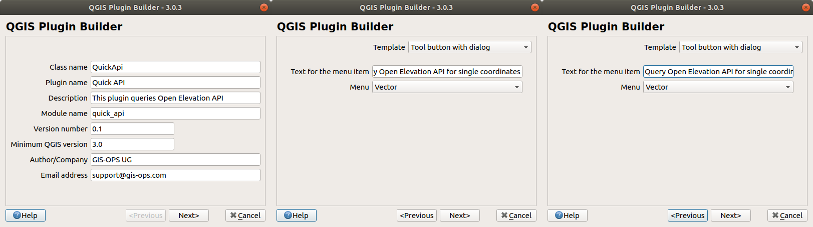

# Create a quick QGIS 3 Plugin

This tutorial is not intended to be a deep dive into QGIS plugins, but rather a guideline for creating a plugin from available boiler plate code based on the very useful [Plugin Builder](http://g-sherman.github.io/Qgis-Plugin-Builder/).

At the end of this tutorial, you will be able to:

- get a little familiar with `PyQGIS`
- build a GUI with QGIS native Qt Designer
- connect GUI elements to Python functions
- test the plugin locally and upload to QGIS official plugin repository

> **Disclaimer**
>
> Validity only confirmed for **Ubuntu 18.04** and **QGIS v3.x**
> Occassionally, the author might choose to give hints on Windows-specific setups. `Ctrl+F` for WINDOWS flags

## Prerequisites

### Hard prerequisites

- Basic understanding of Python
- QGIS v3.x
- [Plugin Builder](https://plugins.qgis.org/plugins/pluginbuilder3/) QGIS plugin installed
- Python >= 3.6 (should be your system Python3)

### Recommendations

- Use an IDE, such as [Sypder](https://www.spyder-ide.org) or [PyCharm](https://www.jetbrains.com/pycharm/)
- Even though we're developing **on** Ubuntu, we should make sure Windows users can use the plugin as well. **Doesn't seem like there is a list for OSGeo4W python packages, awaiting answer from dev list**
- Use the system's Python3 as interpreter for your IDE: `/usr/bin/python3`
- WINDOWS: you're locked in with OSGeo4W for QGIS, but you can have a look [here](https://trac.osgeo.org/osgeo4w/wiki/ExternalPythonPackages#UsestandardWindowsinstallers) on how to change your default Python interpreter to the one shipped with OSGeo4W, for a better developing experience

If you follow above recommendations, you should now be able to run the following:

```bash
/path/to/system-python/python3
# in Python console
import qgis
import PyQt5
```

## First steps

### Plugin Builder

#### About Plugin Builder

The Plugin Builder arguably takes a lot of work off your shoulders, as it creates all necessary boiler plate code you need to immediately start development. However, we found the amount of (well-intentioned) overhead it imposes on us a little overwhelming in the beginning. Consequently, we'll focus for the rest of the tutorial on the most crucial parts of your new plugin.

#### Run Plugin Plugin Builder

If you have successfully installed the Plugin Builder 3 plugin, it is available in the 'Plugins' menu in QGIS. Make sure to fill out the details similar to ours:


