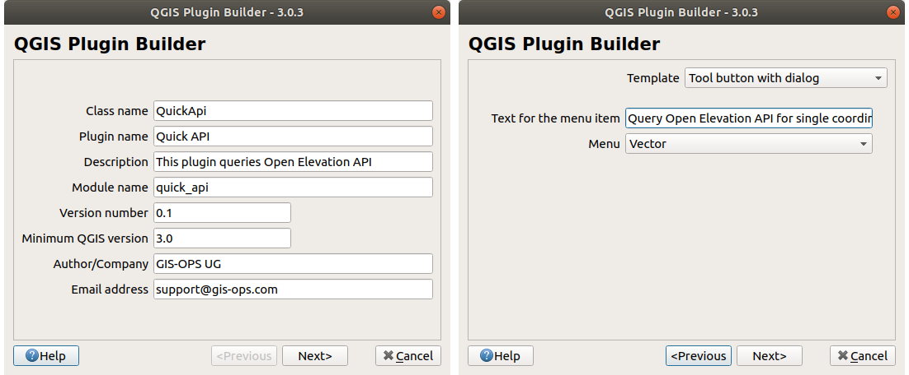
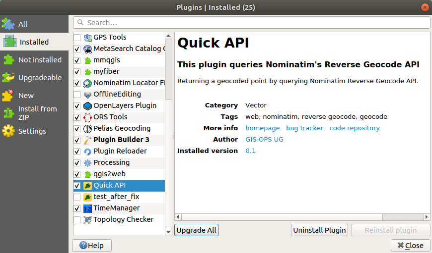

# Create a quick QGIS 3 Plugin

This tutorial is not intended to be a deep dive into QGIS plugins, but rather a guideline for creating a plugin from available boiler plate code based on the very useful [Plugin Builder](http://g-sherman.github.io/Qgis-Plugin-Builder/).

At the end of this tutorial, you will be able to:

- get a little familiar with `PyQGIS`
- build a GUI with QGIS native Qt Designer
- connect GUI elements to Python functions
- test the plugin locally and upload to QGIS official plugin repository

> **Disclaimer**
>
> Validity only confirmed for **Ubuntu 18.04** and **QGIS v3.x**
> Occassionally, the author might choose to give hints on Windows-specific setups. `Ctrl+F` for WINDOWS flags

## Prerequisites

### Hard prerequisites

- Basic understanding of Python
- QGIS v3.x
- [Plugin Builder](https://plugins.qgis.org/plugins/pluginbuilder3/) QGIS plugin installed
- Python >= 3.6 (should be your system Python3)

### Recommendations

- Use an IDE, such as [Sypder](https://www.spyder-ide.org) or [PyCharm](https://www.jetbrains.com/pycharm/)
- Even though we're developing **on** Ubuntu, we should make sure Windows users can use the plugin as well. **Doesn't seem like there is a list for OSGeo4W python packages, awaiting answer from dev list**
- Use the system's Python3 as interpreter for your IDE: `/usr/bin/python3`
- WINDOWS: you're locked in with OSGeo4W for QGIS, but you can have a look [here](https://trac.osgeo.org/osgeo4w/wiki/ExternalPythonPackages#UsestandardWindowsinstallers) on how to change your default Python interpreter to the one shipped with OSGeo4W, for a better developing experience

If you follow above recommendations, you should now be able to run the following:

```bash
/path/to/system-python/python3
# in Python console
import qgis
import PyQt5
```

## First steps

### Plugin Builder

#### About Plugin Builder

The Plugin Builder arguably takes a lot of work off your shoulders, as it creates all necessary boiler plate code you need to immediately start development. However, we found the amount of (well-intentioned) overhead it imposes on us a little overwhelming in the beginning. Consequently, we'll focus for the rest of the tutorial on the most crucial parts of your new plugin.

#### Run Plugin Plugin Builder

If you have successfully installed the Plugin Builder 3 plugin, it is available in the 'Plugins' menu in QGIS. Make sure to fill out the details similar to ours:



Note, there will be a few more dialogs, just use common sense when filling those in. Or accept the defaults.

After confirming where to store your new plugin, you'll presented with dialog detailing what to find where and which steps to take from here. For the sake of this tutorial, ignore its contents. If anything goes wrong with the short descriptions it provides you'll be left with more questions than answers.

#### Generated files

The Plugin Builder will have generated a lot of files now. Head over to your new plugin directory and `ls .`. To avoid confusion and make it as simple as possible, you can safely delete all files and folders except for these:

```bash
├──quickapi
   ├──i18n
   |  └──af.ts
   ├──icon.png
   ├──__init__.py
   ├──metadata.txt
   ├──quick_api.py
   ├──quick_api_dialog.py
   ├──quick_api_dialog_base.ui
   ├──resources.py
   └──resources.qrc
```

This is still a lot to take in. So let's look at them in little more detail:

- `i18n`: this folder contains translation files. Just note, that you will have the folder present for now for the plugin not to crash. A detailed explanation is beyond the scope of this tutorial.

- `icon.png`: the default icon for the plugin. We will change this.

- `__init__.py`: contains the function which will initialize the plugin on QGIS startup and register it with QGIS, so it knows about this plugin.

- `metadata.txt`: contains information about the plugin, which will be used by the official QGIS plugin repository and the QGIS Plugin Manager to display information about your plugin, e.g. description, version, URL etc.

- `quick_api.py`: contains the heart of the plugin: all custom functionality will go into this file.

- `quick_api_dialog.py`: loads the User Interface (UI), when QGIS starts up. We won't alter this file in this tutorial.

- `quick_api_dialog_base.ui`: this is the Qt Designer file to style and build the UI, i.e. plugin window.

- `resource.qrc`: contains the resources for Qt. It's usually only needed to tell QGIS where to find the plugin icon. We will only edit this file when we rename or otherwise change the plugin icon. **Needs to be compiled to resources.py**.

### Test initial plugin

At this point we can already test if QGIS loads our new (very unfunctional) plugin.

#### Compile `resources.qrc`

First we need to compile the `resources.qrc` file to `resources.py`, so that the plugin can pick up the Qt settings:

```bash
pyrcc5 -o resources.py resources.qrc
```

#### Copy code to plugin directory

Next, we should create the directory where your plugin will be picked up by QGIS on startup and copy all files there:

```bash
cp -rf ../quickapi $HOME/.local/share/QGIS/QGIS3/profiles/default/python/plugins/
```

Run this command whenever you change something in your development project.

#### Load plugin

Start QGIS and head over to `Plugins > Manage and Install Plugins` et voila:



If you activate it, note how a toolbar icon is created. Also, you'll find the plugin in the 'Vector' menu in QGIS. No worries, we'll change all that:)

#### Troubleshooting

- if you don't see the plugin in the manager after a QGIS restart, check if you didn't set the `experimental` flag by allowing experimental plugins in `Plugin Manager > Settings`.

- if you experience a Python error, you likely did something wrong in the previous steps. Best bet: start from scratch before you dump an inconceivable amount of time in finding the bug.
