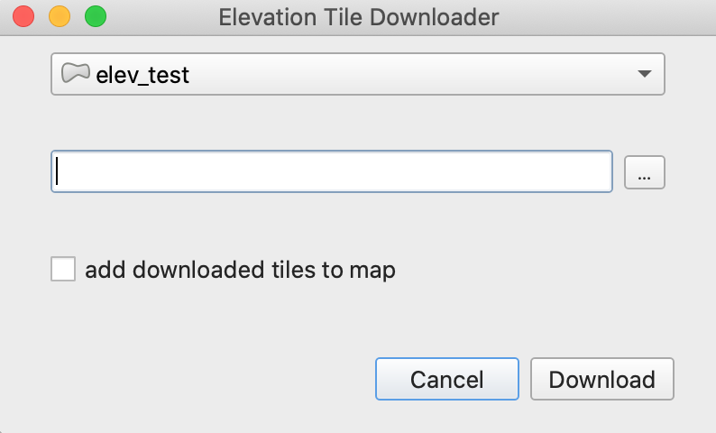

### QGIS Tutorials

# QGIS Tasks – delegate chores to the background

This tutorial shows how to use tasks in pyQGIS by giving a short introduction to the concept and giving an example of how tasks may be utilized in an example plugin. The final plugin code can be found [here](./examples/elevation_tile_downloader). We assume that you are familiar with pyQgis and the basics of plugin development in QGIS. In case you want to catch up on the latter, please refer to our [QGIS plugin development guide](https://gis-ops.com/qgis-3-plugin-tutorial-plugin-development-reference-guide/).

If you miss documentation of some methods or concepts, please [issue on GitHub](https://github.com/gis-ops/tutorials/issues) or create a [pull request](https://github.com/gis-ops/tutorials/pulls) with your enhancement.

**Goals:** 
- become familiar with the concept of tasks in pyQGIS
- create tasks and manage them using QGIS' task manager
- communicating a background task's progress to the user

Imagine you are developing a plugin that requires the user to download huge amounts of geodata and do something with it afterwards. If you simply start the download in your main plugin code, you will notice that the whole program freezes until the download finishes and the rest of the plugin logic completes. What if you wanted to let the user keep using QGIS while the download takes place? Enter tasks, or – more specifically – `QgsTask`. 
Tasks help to perform work in the background, while giving the user GUI control. So not only is this useful for CPU intense work, but also for operations where little of your machine's computing resources are needed, like downloads.

There are three main ways in which tasks can be created:

- creating it from a function,
- from a processing algorithm,
- or by extending `QgsTask`

In this tutorial, we will only cover the latter way. So let's start with a basic plugin idea: we would like to create a small plugin that lets the user download elevation tiles from the [SRTM](https://wiki.openstreetmap.org/wiki/SRTM) global elevation data, that intersect with features from a selected map layer. We create a plugin skeleton using the [QGIS plugin builder](https://plugins.qgis.org/plugins/pluginbuilder/), and create a small custom UI with QtDesigner.



We use a `QgsMapLayerComboBox` to let the user select a map layer to intersect with tiles, and a `QgsFileWidget` to let them specify the directory where downloaded tiles will be saved. Then we add a `QCheckBox` to let the user specify whether or not the tiles shall be added to the current project after the download has finished. Finally, we replace the 'OK' button with a 'Download' button.

Moving on to the plugin logic, most of the work will be done in `elevation_tile_downloader.py`. Since we removed the 'OK' button, the `run()` method will no longer be automatically called, so we can instead write a custom function to run when the 'Download' button is clicked. Let's call it `download_tiles()` and connect it to the download button's `clicked` signal in the dialog's `__init__`:
```python
self.download.clicked.connect(self.download_tiles)
```
Then, we start implementing the logic inside `download_tiles()`. The global SRTM data are split into tiles of 1°x1° and each tile is georeferenced by its file name, which contains the southernmost and the westernmost coordinate. This makes it easy for us to know beforehand which tiles to download: we get the selected features' bounding box, and extend the coordinates to the next integer (by flooring `xMinimum` and `yMininum`, and ceiling `xMaximum` and `yMaximum`), which yields a new bounding box. within this bounding box, we create a 1°x1° grid, and add each grid rectangle that intersects the feature to a list.

Now we're ready to commence the downloads, so this is were `QgsTask` comes in. We create a new file `task.py`, where we subclass `QgsTask`. It's important to note here that we can neither pass any QObjects from QGIS' main thread into the task, nor perform any GUI-based operations from the task. In our case this is no problem, as all we need to pass to the task are the intersecting bounds and output directory path. What we would like to do, however, is communicating the progress to the user. Luckily, we can use signals for this, so we don't have to manipulate the GUI directly from the task. Whenever a tile is downloaded, we want the user to know, so we create a signal called `next_tile`.
The ``__init__`` is straight forward:
```python
self.grid = grid
self.output_dir = output_dir
self.exception = None
self.traceback = None
self.total = len(self.grid)
self.add = add
self.tiles_downloaded: List[Path] = []
self.nam = QgsNetworkAccessManager()
```
The first thing that stand out are the `exception` and `traceback` attributes. When running a `QgsTask`, we cannot raise exceptions (This would crash the entire QGIS instance), therefore one way to avoid this is to try and catch them, and communicate the exception and the traceback to the user.

Next, we need to define two class methods: `run()` and `finished()`. The first is automatically executed when we start the task, and the latter is called as soon as the task finishes. So we implement the actual file downloading in `run()`. There, we iterate over the rectangles, and construct the urls from the southernmost and westernmost bound and emit the `next_tile` signal each time a tile download starts and connect to it in the dialog, so that we can forward the info to the main window's `statusBar`. Now as each tile download progresses, we would like to communicate the progress to the main status bar's built-in progress bar. Luckily, `QgsTask` has a built-in method for this (`updateProgress()`) that the main status bar automatically connects to. So we get the file's content length (i.e., file size) via the http header and then iterate over the file stream, write it in 2 MB chunks and set the new progress each time a chunk is written.

Now, we have implemented the main logic, but we are not done yet. As mentioned earlier, we want to avoid any raised exceptions, so the easiest way to handle this would be to simply wrap this logic in a `try`/`except` block and assign any exception and traceback as a class attribute so we can access it after `run()` finishes (you would likely want more sophisticated error handling, but this works for now). Finally, the `run()` method always needs to return a boolean that indicates whether the task ran successfully. If the user cancels the task, or if we catch an exception, we want the method to return `False`, and `True` otherwise. This result is then automatically passed on to the `finished()` method, where we can then decide how to proceed depending on whether the task ran successfully. In our case, we don't need to do a lot: we check whether the user wants to add the downloaded tiles to the project, and communicate some information about the download process by logging messages to the `QgsMessageLog`. This log is also available from the `run()` method and is in fact the easiest way to communicate from the task while it's running, since `print()` would crash the program.

Finally, we only need to run the task. This can be done by using the application's `QgsTaskManager`. It is a singleton available through `QgsApplication.taskManager()` and it's in charge of delegating all background tasks (so yours might not be the only one running). In `elevation_tile_downloader_dialog.py`, we create an instance of our derived task class and add it to the task queue like this: `QgsApplication.taskManager().addTask(self.task)`. For improved UX, we connect the task's automatically emitted signals (`begun`, `taskCompleted` and `taskTerminated`) and hide, close, or show our plugin window respectively.

And that's it! We have successfully created a small plugin that downloads SRTM tiles in the background by using `QgsTask` and the `QgsTaskManager`, so that the user can continue interacting with QGIS while the download runs.
